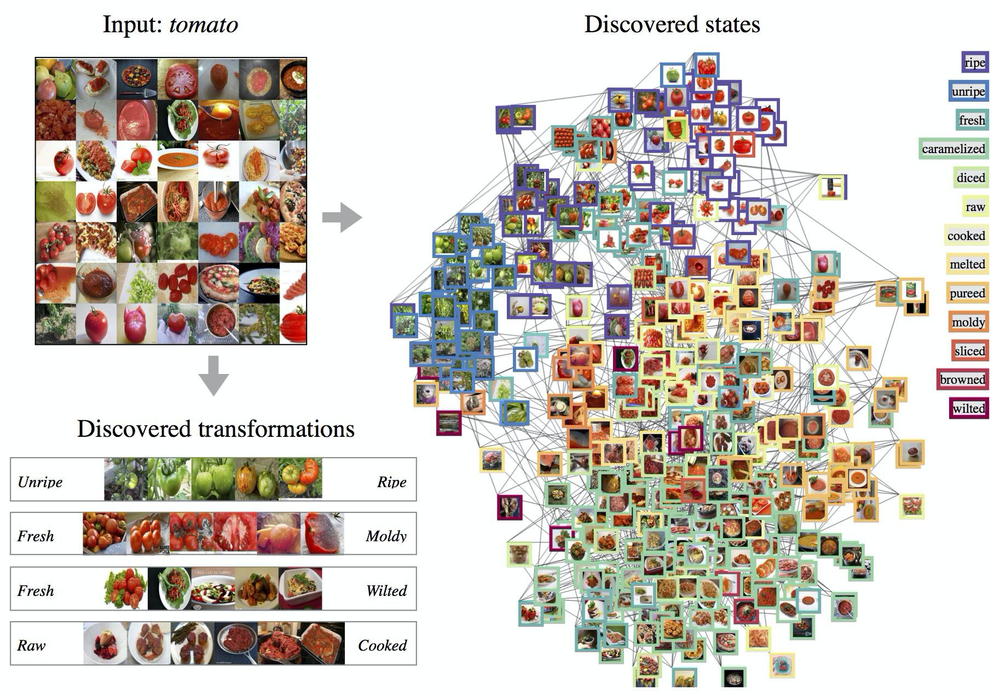
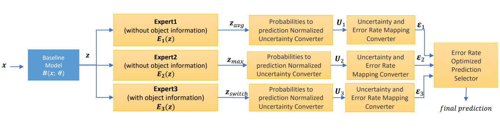
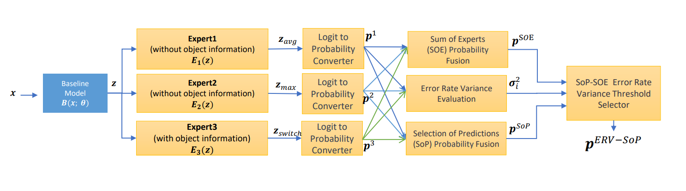

# Selection-of-Predictions

We present our code on CZSL Dataset and Ensemble Learning Dataset in two folder. Please go into the links below for more information.

## Dataset

[**CZSL Dataset**](https://github.com/SerenityOuO/DFSP_project) |  [**Ensemble Learning Dataset**](https://github.com/SerenityOuO/test-ensemble-learning)
:-------------------------:|:-------------------------:
 |  

## Abstract
This study delves into the optimal combination of these models, focusing on their performances across varied datasets and scenarios.We propose a method named SoP (Selection of Prediction) by establishing a mapping table linking uncertainties to error rates for each model, which enables the selection of models with lower error rates. When faced with significant variances among models, our approach exhibits a performance edge over conventional ensemble learning techniques.Subsequently, we introduce an innovative hierarchical method named Mix of Experts of Mix of Experts (MoM), extending the conventional "Mix of Experts" paradigm across two tiers to refine prediction accuracy further, even for non-significant variance cases. In our experimental section, the methodology finds application in real-world datasets, specifically from Compositional Zero-Shot Learning and Ensemble Learning, underscoring its advantage in boosting performance.

## Model architecture

- ** SoP :**

- ** ERV-SoP :**

- ** Mix SoP :**

